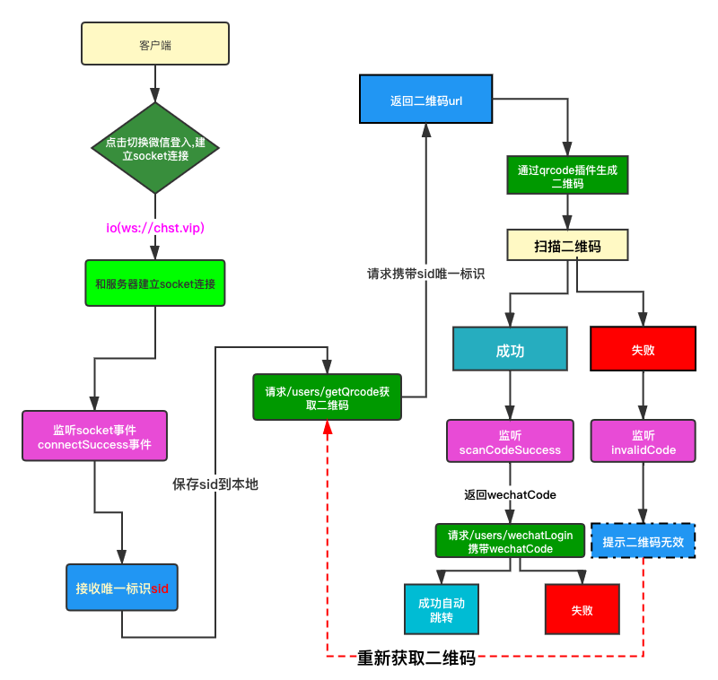

# 学员项目管理系统api接口

> 使用须知!!:本接口采用`jwt`数据安全措施,如果想正常获取数据,请`先登入`,并且保证每次请求传送`authorization`请求头,携带登入之后返回的的`token`

管理系统后台v2.0.1更新公告:
增加权限控制,角色列表获取,权限菜单获取 
增加获取用户功能 优化拦截中间件 
优化路径不匹配返回权限错误的问题 
修复静态资源需要登入而获取不到的情况 
修复图片上传不显示问题
文档更新 详情请访问 https://gitee.com/d718781500/student_product_manager_system

## 使用

**补齐依赖**

```
npm install
```

或者

```
yarn
```

开启服务**

```
npm start
```

# base:http://www.chst.vip

# 测试账号:lbw 密码:555

# 1.天气模块(新)

天气每隔8小时会同步一次,每天0点必定同步一次

## 获取天气

| 接口详情 | 请求方式 |        地址         |
| :------: | :------: | :-----------------: |
|   天气   |   get    | /weather/getWeather |

| 参数 | 是否必填 |                        说明                         |
| :--: | :------: | :-------------------------------------------------: |
| key  |    否    |        key的取值为all,传了则返回所有历史天气        |
| city |    否    | 查询的城市名字,不能带市,比如南京,次数一分钟查询一次 |

## 修改天气账户信息(仅root有权限)

天气账户有可能变更,所以提供修改接口

|   接口详情   | 请求方式 |            地址             |
| :----------: | :------: | :-------------------------: |
| 修改天气账户 |   get    | /weather/updateWeatherCount |

|   参数    | 是否必填 |               说明                |
| :-------: | :------: | :-------------------------------: |
|  version  |    是    | 请求api的版本,有不同的天气比如v61 |
|   appid   |    是    |         appid账号生成的id         |
| appsecret |    是    |         账户生成的secret          |

# 2.上传图片

增加上传图片,所有的图片都可以通过这个接口上传

| 接口详情 | 请求方式 |       地址        |
| :------: | :------: | :---------------: |
| 上传图片 |   post   | /upload/uploadImg |

| 参数 | 是否必填 |   说明   |
| :--: | :------: | :------: |
| img  |    是    | 图片文件 |

# 3.学员模块

## 获取登入日志 

|   接口详情   | 请求方式 |     地址     |
| :----------: | :------: | :----------: |
| 获学登入日志 |   get    | /getloginlog |

| 参数  | 是否必填 |          说明           |
| :---: | :------: | :---------------------: |
| page  |    否    |          页码           |
| count |    否    | 每次返回几条 默认返回10 |

成功返回值

```json
{
    "status": 200,
    "state": true,
    "msg": "success",
    "data": [
        {
            "_id": "5cd964db16bd6f346879cf77",
            "username": "cxk",
            "lastLogin": {
                "loginTime": "2019/05/13 20:36:26",
                "ip": ""
            },
            "nowLogin": {
                "ip": "",
                "loginTime": "2019/05/13 20:36:43"
            },
            "__v": 0
        },
        {
            "_id": "5cd964ca16bd6f346879cf76",
            "username": "cxk",
            "lastLogin": {
                "loginTime": "2019/05/13 20:36:00",
                "ip": ""
            },
            "nowLogin": {
                "ip": "",
                "loginTime": "2019/05/13 20:36:26"
            },
            "__v": 0
        }
    ]
}
```


## 获取班级列表

| 接口详情 | 请求方式 |         地址         |
| :------: | :------: | :------------------: |
| 班级列表 |   get    | /students/getclasses |

成功返回值

```json
{
    "status": 200,
    "state": true,
    "data": [
        "H51901",
        "H51902"
    ]
}
```


## 获取学员信息

|  接口详情  | 请求方式 |         地址         |
| :--------: | :------: | :------------------: |
| 获学员信息 |   get    | /students/getstulist |

| 参数  | 是否必填 |         说明         |
| :---: | :------: | :------------------: |
| page  |    否    |         页码         |
| count |    否    |     每次返回几条     |
| class |    否    | 默认是全部班级的数据 |

成功返回值

```javascript
{
    "status": 1,
    "state": true,
    "msg": "请求成功",
    "total": 2,
    "data": [
        {
            "_id": "5cd3c534e1e75b0ea034cf83",
            "name": "谭鹏",
            "headimgurl":"",
            "age": "21",
            "class": "H51901",
            "city": "重庆",
            "degree": "专科",
            "productUrl": "地址",
            "description": "O(∩_∩)O哈哈~",
            "cTime": "2019/05/09 02:14:12",
            "sId": "WWLN97178546",
            "__v": 0
        }
    ]
}
```


## 增加学员信息

|   接口详情   | 请求方式 |    接口地址     |
| :----------: | :------: | :-------------: |
| 增加学员信息 |   post   | /students/addstu |

|    参数     | 是否必填 |        描述        |
| :---------: | :------: | :----------------: |
|    class    |    是    |        班级        |
|    name     |    是    |     学员的名字     |
|     age     |    是    |     学员的年龄     |
|    city     |    是    |   目前居住的城市   |
|   degree    |    是    |        学历        |
| productUrl  |    是    |      项目地址      |
| description |    是    | 一句话对自己的评价 |
|  headimgurl  |    否    |        头像        |
|             |          |                    |

增加成返回值

```json
{
    "status": 1,
    "state": true,
    "msg": "添加成功"
}
```

## 删除学员信息

|  接口详情  | 请求方式 |       接口地址       |
| :----: | :--: | :--------------: |
| 删除学员信息 | get  | /students/delstu |

| 参数 | 是否必填 |    描述    |
| :--: | :------: | :--------: |
| sId  |    是    | 当前学员id |
|      |          |            |

```javascript
// 删除成功
{
  "status": 1,
  "state": true,
  "msg": "删除成功"
}
```

## 修改学员信息

|  接口详情  | 请求方式 |        接口地址         |
| :----: | :--: | :-----------------: |
| 修改用户密码 | post | /students/updatestu |

|    参数     | 是否必填 |        描述        |
| :---------: | :------: | :----------------: |
|     sId     |    是    |       用户Id       |
|    token    |    是    |      token值       |
|    name     |    否    |     学员的名字     |
|     age     |    否    |     学员的年龄     |
|    city     |    否    |   目前居住的城市   |
|   degree    |    否    |        学历        |
| productUrl  |    否    |      项目地址      |
| description |    否    | 一句话对自己的评价 |
|  headimgurl  |    否    |        头像        |

## 搜索学员
| 接口详情 | 请求方式 |        地址         |
| :------: | :------: | :-----------------: |
| 搜索学员 |   get    | /students/searchstu |


| 参数 | 是否必填 |      描述      |
| :--: | :------: | :------------: |
| key  |    否    | 传入学员的姓名 |
| count  |    否    | 请求的条数(默认全部返回) |
| page  |    否    | 页码 |

## 上传学员头像接口

|   接口详情   | 请求方式 |         接口地址          |
| :----------: | :------: | :-----------------------: |
| 上传学员头像 |   post   | /students/uploadStuAvatar |

|  参数  | 是否必填 |             描述             |
| :----: | :------: | :--------------------------: |
| headimgurl |    是    | 上传的文件格式 jpg\|png\|gif |
```javascript
//成功数据
{
    status: 200,
    state: true,
    msg: "上传成功",
    headimgurl:http://106.12.79.128xxxx
 }
```
# 4.用户模块

## 获取验证码
|   接口详情   | 请求方式 |       地址        |
| :----------: | :------: | :---------------: |
| 获取验证码 |   get    | /users/getCaptcha |

## 刷新验证码
|   接口详情   | 请求方式 |       地址        |
| :----------: | :------: | :---------------: |
| 获取验证码 |   get    | /users/refreshCaptcha |

## 校验验证码
|   接口详情   | 请求方式 |       地址        |
| :----------: | :------: | :---------------: |
| 获取验证码 |   get    | /users/verifyCaptcha |

|    参数    | 是否必填 |  描述  |
| :------: | :--: | :--: |
| captcha |  是   | 用户输入的验证码  |

## 获取所有用户

|   接口详情   | 请求方式 |       地址        |
| :----------: | :------: | :---------------: |
| 获取所有用户 |   get    | /users/getAllUers |

```javascript
{
    "status": 200,
    "state": true,
    "msg": "success",
    "users": [
        {
            "username": "lbw1",
            "nickname": "五五开",
            "roleid": "200"
        },
        {
            "username": "root",
            "nickname": "王者管理员",
            "roleid": "1"
        },
        {
            "username": "lbw2",
            "nickname": "五五开",
            "roleid": "200"
        },
        {
            "username": "zj",
            "nickname": "王远杰",
            "roleid": "102"
        },
        {
            "username": "zj01",
            "nickname": "巴啦啦小魔仙",
            "roleid": "102"
        }
    ]
}
```


## 用户注册接口(仅root管理员有权限)

|  接口详情  | 请求方式 |       地址        |
| :----: | :--: | :-------------: |
| 用户注册接口 | post | /users/register |

|    参数    | 是否必填 |  描述  |
| :------: | :--: | :--: |
| username |  是   | 用户名  |
| password |  是   |  密码  |
|  phone   |  否   | 手机号  |
| nickname |  是   |  昵称  |
|  roles   |  否   |  权限  |

```json
注册成功返回值
{
	"status": 1,
	"state": true,
	"msg": "注册成功",
	"userInfo": {
		"username": "lbw4",
		"nickname": "开哥永不开挂",
		"phone": "1577775772"
	}
}
注册失败返回值
{
	"status": 0,
	"state": false,
	"msg": "用户名已注册"
}
```

## 登入接口

| 接口详情 | 请求方式 |      地址      |
| :--: | :--: | :----------: |
| 用户登入 | post | /users/login |

| 参数       | 是否必填 | 描述   |
| -------- | ---- | ---- |
| username | 是    | 账户   |
| password | 是    | 密码   |

```json
登入成功返回值
{
	"status": 1,
	"state": true,
	"msg": "登入成功",
	"userInfo": {
		"username": "lbw4",
		"nickname": "开哥永不开挂",
		"phone": "1577775772"
	}
}
登入失败返回值
{
	"status": 0,
	"state": false,
	"msg": "用户名或者密码错误"
}
```

## 微信扫码登入(new)

微信扫码登入建议客户端使用socket.io-client@2.3.0这个依赖

首先安装

```js
npm i socket.io-client
```

也可以使用普通的websocket

### socket.io事件

|     事件名      |  返回参数  |         参数描述         |
| :-------------: | :--------: | :----------------------: |
| connectSuccess  |    sid     |      客户端唯一标识      |
|   invalidCode   |   Object   |    无效二维码主体内容    |
| scancodeSuccess | wechatCode | 用户微信扫码返回临时code |

### 接口

#### 获取二维码url

|       接口       | 请求方式 | 携带参数 | 是否必填 |      接口描述      |
| :--------------: | :------: | :------: | :------: | :----------------: |
| /users/getQrcode |   get    |   sid    |    是    | 请求微信二维码地址 |

#### 微信登入

|        接口        | 请求方式 |   接口描述   |
| :----------------: | :------: | :----------: |
| /users/wechatLogin |   get    | 请求微信登入 |

|    参数    | 是否必填 |             参数描述             |
| :--------: | :------: | :------------------------------: |
| wechatCode |    是    | 扫码成功后微信传回来的wechatCode |

### 流程图



## 退出登入接口

| 接口详情 | 请求方式 |     接口地址      |
| :--: | :--: | :-----------: |
| 退出登入 | get  | /users/sigout |

## 上传用户头像接口

| 接口详情 | 请求方式 |        接口地址         |
| :--: | :--: | :-----------------: |
| 上传头像 | post | /users/uploadAvatar |


|   参数   | 是否必填 |   描述    |
| :----: | :--: | :-----: |
| headimgurl |  是   | 上传的图片文件 |
|  uId   |  是   | 当前用户的id |
| token  |  是   | token值  |

```json
//成功数据
{
  "status": 1,
  "state": true,
  "msg": "图片上传成功"
}
```

## 校验登入状态

|   接口详情   | 请求方式 |  接口地址   |
| :------: | :--: | :-----: |
| 验证用户登入状态 |  *   | /verify |

## 修改用户密码接口

|  接口详情  | 请求方式 |         接口地址          |
| :----: | :--: | :-------------------: |
| 修改用户密码 | post | /users/updatePassword |

|     参数      | 是否必填 |    描述    |
| :---------: | :--: | :------: |
|  username   |  是   |   用户名    |
| oldPassword |  是   |  原来的密码   |
| newPassword |  是   | 需要修改的新密码 |
|    token    |  是   |  token值  |

```json
//修改成功值
{
  "status": 1,
  "state": true,
  "msg": "密码修改成功"
}
//用户名不存在返回值
{
  "status": 0,
  "state": false,
  "msg": "不存在此用户"
}
//修改失败
{
  "status": 0,
  "state": false,
  "msg": "密码修改错误"
}
```

# 5.权限模块

## 添加角色(仅root有权限)

| 接口详情 | 请求方式 |      接口地址       |
| :------: | :------: | :-----------------: |
| 添加角色 |   post   | /permission/addrole |

|  参数  | 是否必填 |     描述     |
| :----: | :------: | :----------: |
| roleid |    是    | 添加的角色id |
| token  |    是    |    token     |

## 获取角色列表

|   接口详情   | 请求方式 |      接口地址       |
| :----------: | :------: | :-----------------: |
| 获取角色列表 |   get    | /permission/getrole |

|  参数  | 是否必填 |     描述     |
| :----: | :------: | :----------: |
| roleid |    否    | 查询的角色id |
| token  |    是    |    token     |

```json
结果
{
    "status": 200,
    "msg": "success",
    "roles": [
        {
            "roleid": "200",
            "roleName": "员工"
        },
        {
            "roleid": "102",
            "roleName": "总监"
        },
        {
            "roleid": "103",
            "roleName": "主管"
        },
        {
            "roleid": "1",
            "roleName": "王者管理员"
        }
    ]
}
```
## 获取权限菜单
|   接口详情   | 请求方式 |        接口地址         |
| :----------: | :------: | :---------------------: |
| 获取权限菜单 |   get    | /permission/getMenuList |

```json
{
    "status": 200,
    "msg": "success",
    "roleName": "总监",
    "menuList": [
        {
            "name": "管理首页"
        },
        {
            "name": "学员管理",
            "children": [
                {
                    "name": "学员项目管理"
                },
                {
                    "name": "学员资料"
                },
                {
                    "name": "学员宿舍"
                }
            ]
        },
        {
            "name": "考勤管理"
        },
        {
            "name": "数据统计"
        },
        {
            "name": "我的中心"
        }
    ]
}
```


# 6.商城模块

## 5.1 类目模块

### 5.1.1 增加类目

|       接口地址        | 请求方式 |   接口描述   |
| :-------------------: | :------: | :----------: |
| /category/addCategory |   post   | 添加商品类目 |

|      参数      |     参数描述     | 是否必传 |
| :------------: | :--------------: | :------: |
|  categoryName  | 类目名称(String) |    是    |
| categoryImgurl |     类目图片     |    否    |

响应成功

```js
{
    "status": 200,
    "state": true,
    "msg": "添加成功"
}
```

响应失败结果

```js
{
    "status": 1004,
    "state": false,
    "msg": "已经存在该类目,请不要重复添加"
}
```

### 5.1.2 删除类目(慎用)

由于类目和商品关联,如果类目中还有商品,删除会导致商品类目获取不正确

|       接口地址        | 请求方式 | 接口描述 |
| :-------------------: | :------: | :------: |
| /category/delCategory |   get    | 删除类目 |

|    参数     | 请求方式 | 接口描述 |
| :---------: | :------: | :------: |
| category_id |   get    |  类目id  |

响应成功结果

```json
{
    "status": 200,
    "state": true,
    "msg": "删除成功"
}
```

响应失败结果

```js
{
    "status": 1004,
    "state": false,
    "msg": "err 该数据不存在"
}
```

### 5.1.3 修改类目

|         接口地址         | 请求方式 | 接口描述 |
| :----------------------: | :------: | :------: |
| /category/updateCategory |   post   | 删除类目 |

|     参数     |   描述   | 是否必传 |
| :----------: | :------: | :------: |
| categoryName | 类目名称 |    是    |
| category_id  |  类目id  |    是    |

### 5.1.4 获取类目

响应成功结果

```json
{
    "status": 200,
    "state": true,
    "msg": "获取成功",
    "data": [
        {
            "updateTime": null,
            "updator": null,
            "_id": "5fed5acfb308240d6037bc13",
            "category_id": "20201231125959413",
            "categoryName": "车辆",
            "creator": "lbw",
            "createTime": "2020-12-31,12:59:59"
        },
        {
            "updateTime": null,
            "updator": null,
            "_id": "5fed5c45b308240d6037bc19",
            "category_id": "20201231130613547",
            "categoryName": "化妆品",
            "creator": "lbw",
            "createTime": "2020-12-31,01:06:13"
        }
    ]
}
```


## 5.2 商品模块

### 5.2.1 添加商品信息

|       接口地址       | 请求方式 | 接口描述 |
| :------------------: | :------: | :------: |
| /product/add_product |   post   | 添加商品 |

|    参数     |                  描述                   | 是否必传 |
| :---------: | :-------------------------------------: | :------: |
| category_id |            类目的id (String)            |    是    |
| productName |            商品名称 (String)            |    是    |
|    price    | 商品价格 (Number) 单位以人民币为单位:元 |    是    |
| description |            商品描述 (String)            |    是    |
|  inventory  |            商品库存 (Number)            |    是    |
|  imageUrl   |      商品图片 (file) 上传商品图片       |    是    |

### 5.2.2 修改商品信息

|        接口地址         | 请求方式 |   接口描述   |
| :---------------------: | :------: | :----------: |
| /product/update_product |   post   | 修改商品信息 |

|    参数     |                  描述                   | 是否必传 |
| :---------: | :-------------------------------------: | :------: |
| category_id |            类目的id (String)            |    是    |
| productName |            商品名称 (String)            |    否    |
|    price    | 商品价格 (Number) 单位以人民币为单位:元 |    否    |
| description |            商品描述 (String)            |    否    |
|  inventory  |            商品库存 (Number)            |    否    |
|  imageUrl   |      商品图片 (file) 上传商品图片       |    否    |

### 5.2.3 获取商品信息

|       接口地址       | 请求方式 |   接口描述   |
| :------------------: | :------: | :----------: |
| /product/get_product |   get    | 获取商品信息 |

|    参数     |             描述              | 是否必传 |
| :---------: | :---------------------------: | :------: |
| product_id  | 商品的id,不传默认返回所有数据 |    否    |
| category_id |        商品所在类目id         |    否    |

### 5.2.4 删除商品

|       接口地址       | 请求方式 |   接口描述   |
| :------------------: | :------: | :----------: |
| /product/del_product |   get    | 删除商品信息 |

|    参数    |   描述   | 是否必传 |
| :--------: | :------: | :------: |
| product_id | 商品的id |    是    |


## 5.3 购物车模块

### 5.3.1 购物车选中商品

|  接口地址   | 请求方式 |    参数    |                           接口描述                           |
| :---------: | :------: | :--------: | :----------------------------------------------------------: |
| /cart/check |   post   | product_id | 传递产品的id,如果存在选中多个商品,那么可以以字符串的形式用逗号(,)隔开比如 {product_id:"1198,16843,19894"} |

### 5.3.2 获取购物车数据

|    接口地址    | 请求方式 |         接口描述         |
| :------------: | :------: | :----------------------: |
| /cart/get_cart |   get    | 获取当前用户的购物车数据 |

### 5.3.3 删除购物车商品

|     接口地址     | 请求方式 |    接口描述    |
| :--------------: | :------: | :------------: |
| /cart/del_prouct |   get    | 删除购物车商品 |

|    参数    | 是否必填 |       描述       |
| :--------: | :------: | :--------------: |
| product_id |    是    | 要删除的商品的id |

### 5.3.4 更新购物车数据

|     接口地址      | 请求方式 |        接口描述        |
| :---------------: | :------: | :--------------------: |
| /cart/update_cart |   post   | 修改购物车中商品数量等 |

|    参数    | 是否必填 |      描述      |
| :--------: | :------: | :------------: |
| product_id |    是    |  修改的商品id  |
|   count    |    是    | 修改的商品数量 |

### 5.3.5 增加商品到购物车

|     接口地址      | 请求方式 |     接口描述     |
| :---------------: | :------: | :--------------: |
| /cart/add_to_cart |   post   | 增加商品到购物车 |

|    参数    | 是否必填 |          描述          |
| :--------: | :------: | :--------------------: |
| product_id |    是    |  增加到购物车的商品id  |
|   count    |    是    | 增加到购物车商品的数量 |

## 5.4.订单模块

### 5.4.1 生成预支付订单(订单默认2分钟后失效)

|    接口地址    | 请求方式 |        参数        |     接口描述     |
| :------------: | :------: | :----------------: | :--------------: |
| /pay/pre_order |   post   | 用户必须是登入状态 | 用于提交生成订单 |

|        参数        | 是否必传 |    参数描述    |
| :----------------: | :------: | :------------: |
| product_id<String> |    否    |    产品的id    |
|  quantity<Number>  |    否    | 购买的产品数量 |

#### 订单状态

`order_status`:订单状态:0未提交 1提交成功 2已经取消 3无效订单 4.交易关闭 5退货

#### 订单支付状态

`pay_status`:0未支付 1已支付

#### 订单配送状态 

`shiping_status`:配送状态 0未发货 1已发货 2已收货 3备货中

### 5.4.2 查询订单支付状态

|         接口地址          | 请求方式 |        参数        |          接口描述          |
| :-----------------------: | :------: | :----------------: | :------------------------: |
| /order/query_order_status |   get    | 用户必须是登入状态 | 查询订单的支付状态(可轮询) |

|       参数       | 是否必传 | 参数描述 |
| :--------------: | :------: | :------: |
| order_id<String> |    是    |  订单id  |

### 5.4.1 查询订单详情

可以通过轮询查询订单支付状态,必须携带order_id

|     接口地址     | 请求方式  |       接口描述       |
| :--------------: | :--: | :------------------: |
| /order/get_order |   post   |查询当前用户订单状态 |

|   参数   | 是否必传 |                    参数描述                     |
| :------: | :------: | :---------------------------------------------: |
| order_id |    否    | 传递该参数可以获得单个订单详情,默认返回所有订单 |

### 5.4.2 删除订单

|     接口地址     | 请求方式 |   参数   |    接口描述    |
| :--------------: | :------: | :------: | :------------: |
| /order/del_order |   get    | order_id | 删除指定的订单 |

### 5.4.3 取消订单(待开发)

|   接口地址    | 请求方式 |   参数   |     接口描述     |
| :-----------: | :------: | :------: | :--------------: |
| /order/cancel |   get    | order_id | 用于取消当前订单 |

### 5.4.4 发货配送(待开发)

|  接口地址   | 请求方式 |    接口描述    |
| :---------: | :------: | :------------: |
| /order/ship |   get   | 删除指定的订单 |

|   参数   |            参数描述             | 是否必传 |
| :------: | :-----------------------------: | :------: |
|  action  | 0未发货 1已发货 2已收货 3备货中 |    是    |
| order_id |             订单号              |    是    |

#### e.g

```js
axios.get("/order/ship?action=1")
```

### 5.4.5 退货(待开发)

|    接口地址    | 请求方式 | 接口描述 |
| :------------: | :------: | :------: |
| /order/returns |   post   | 用户退货 |

|   参数   | 参数描述 | 是否必传 |
| :------: | :------: | :------: |
| order_id |  订单号  |    是    |

## 6.支付

### 6.1 PC扫码微信支付

|   接口地址   | 请求方式 | 接口描述 |
| :----------: | :------: | :------: |
| /pay/payment |   post   | 发起支付 |

|     参数     |             参数描述             |    是否必传     |
| :----------: | :------------------------------: | :-------------: |
|    appid     |            公众账号ID            |       是        |
|    mch_id    |       微信支付分配的商户号       |       是        |
|  trade_type  | 交易类型,值:NATIVE、 JSAPI、 APP | 否 (默认NATIVE) |
|   order_id   |              订单id              |       是        |

请求示例:

```js
axios.post("/pay/payment",{
	appid:wxed58e834201d0894,
	mch_id:1568650321,
	order_id:20201231103338122jnvk4na61h
})
```

请求成功返回文档

```json
{
    "status": 200,
    "state": true,
    "msg": "OK",
    "prepay_id": "wx301847582783578da0cb5e1a6f24890000",
    "trade_type": "NATIVE",
    "code_url": "weixin://wxpay/bizpayurl?pr=hPUTMw4zz"
}
```

前端通code_url生成支付二维码即可

### 6.2 通过订单查询支付状态

#### 接口说明

**适用对象：** 直连商户（直连模式）

**请求URL：** https://api.mch.weixin.qq.com/v3/pay/transactions/out-trade-no/{out_trade_no}

**请求方式：**GET


path指该参数为路径参数

query指该参数需在请求URL传参

body指该参数需在请求JSON传参

#### 请求参数

| 参数名     | 变量         | 类型[长度限制] | 必填 | 描述                                         |
| :--------- | :----------- | :------------- | :--- | :------------------------------------------- |
| 直连商户号 | mchid        | string[1,32]   | 是   | query 直连商户的商户号，由微信支付生成并下发 |
| 商户订单号 | out_trade_no | string[1,32]   | 是   | path 商户系统内部订单号                      |

#### 请求示例

- [URL](javascript:;)

```
https://api.mch.weixin.qq.com/v3/pay/transactions/out-trade-no/1217752501201407033233368018?mchid=1230000109
```

#### 返回参数

| 参数名         | 变量             | 类型[长度限制] | 必填 | 描述                                                         |
| :------------- | :--------------- | :------------- | :--- | :----------------------------------------------------------- |
| 应用ID         | appid            | string[1,32]   | 是   | 直连商户申请的公众号或移动应用appid。 示例值：wxd678efh567hg6787 |
| 直连商户号     | mchid            | string[1,32]   | 是   | 直连商户的商户号，由微信支付生成并下发。 示例值：1230000109  |
| 商户订单号     | out_trade_no     | string[6,32]   | 是   | 商户系统内部订单号，只能是数字、大小写字母_-*且在同一个商户号下唯一，详见【商户订单号】。 示例值：1217752501201407033233368018 |
| 微信支付订单号 | transaction_id   | string[1,32]   | 否   | 微信支付系统生成的订单号。 示例值：1217752501201407033233368018 |
| 交易类型       | trade_type       | string[1,16]   | 否   | 交易类型，枚举值： JSAPI：公众号支付 NATIVE：扫码支付 APP：APP支付 MICROPAY：付款码支付 MWEB：H5支付 FACEPAY：刷脸支付 示例值：MICROPAY |
| 交易状态       | trade_state      | string[1,32]   | 是   | 交易状态，枚举值： SUCCESS：支付成功 REFUND：转入退款 NOTPAY：未支付 CLOSED：已关闭 REVOKED：已撤销（付款码支付） USERPAYING：用户支付中（付款码支付） PAYERROR：支付失败(其他原因，如银行返回失败) 示例值：SUCCESS |
| 交易状态描述   | trade_state_desc | string[1,256]  | 是   | 交易状态描述 示例值：支付失败，请重新下单支付                |
| 付款银行       | bank_type        | string[1,16]   | 否   | 银行类型，采用字符串类型的银行标识。 示例值：CMC             |
| 附加数据       | attach           | string[1,128]  | 否   | 附加数据，在查询API和支付通知中原样返回，可作为自定义参数使用 示例值：自定义数据 |
| 支付完成时间   | success_time     | string[1,64]   | 否   | 支付完成时间，遵循[rfc3339](https://tools.ietf.org/html/rfc3339)标准格式，格式为YYYY-MM-DDTHH:mm:ss+TIMEZONE，YYYY-MM-DD表示年月日，T出现在字符串中，表示time元素的开头，HH:mm:ss表示时分秒，TIMEZONE表示时区（+08:00表示东八区时间，领先UTC 8小时，即北京时间）。例如：2015-05-20T13:29:35+08:00表示，北京时间2015年5月20日 13点29分35秒。 示例值：2018-06-08T10:34:56+08:00 |
| +支付者        | payer            | object         | 是   | 支付者信息                                                   |
|                |                  |                |      |                                                              |
| +订单金额      | amount           | object         | 否   | 订单金额信息，当支付成功时返回该字段。                       |
|                |                  |                |      |                                                              |
| +场景信息      | scene_info       | object         | 否   | 支付场景描述                                                 |
|                |                  |                |      |                                                              |
| +优惠功能      | promotion_detail | array          | 否   | 优惠功能，享受优惠时返回该字段。                             |
|                |                  |                |      |                                                              |

#### 返回示例

- [正常示例](javascript:;)

```json
{
	"transaction_id": "1217752501201407033233368018",
	"amount": {
		"payer_total": 100,
		"total": 100,
		"currency": "CNY",
		"payer_currency": "CNY"
	},
	"mchid": "1230000109",
	"trade_state": "SUCCESS",
	"bank_type": "CMC",
	"promotion_detail": [{
		"amount": 100,
		"wechatpay_contribute": 0,
		"coupon_id": "109519",
		"scope": "GLOBALSINGLE",
		"merchant_contribute": 0,
		"name": "单品惠-6",
		"other_contribute": 0,
		"currency": "CNY",
		"type": "CASHNOCASH",
		"stock_id": "931386",
		"goods_detail": [{
			"goods_remark": "商品备注信息",
			"quantity": 1,
			"discount_amount": 1,
			"goods_id": "M1006",
			"unit_price": 100
		}, {
			"goods_remark": "商品备注信息",
			"quantity": 1,
			"discount_amount": 1,
			"goods_id": "M1006",
			"unit_price": 100
		}]
	}, {
		"amount": 100,
		"wechatpay_contribute": 0,
		"coupon_id": "109519",
		"scope": "GLOBALSINGLE",
		"merchant_contribute": 0,
		"name": "单品惠-6",
		"other_contribute": 0,
		"currency": "CNY",
		"type": "CASHNOCASH",
		"stock_id": "931386",
		"goods_detail": [{
			"goods_remark": "商品备注信息",
			"quantity": 1,
			"discount_amount": 1,
			"goods_id": "M1006",
			"unit_price": 100
		}, {
			"goods_remark": "商品备注信息",
			"quantity": 1,
			"discount_amount": 1,
			"goods_id": "M1006",
			"unit_price": 100
		}]
	}],
	"success_time": "2018-06-08T10:34:56+08:00",
	"payer": {
		"openid": "oUpF8uMuAJO_M2pxb1Q9zNjWeS6o"
	},
	"out_trade_no": "1217752501201407033233368018",
	"appid": "wxd678efh567hg6787",
	"trade_state_desc": "支付失败，请重新下单支付",
	"trade_type": "MICROPAY",
	"attach": "自定义数据",
	"scene_info": {
		"device_id": "013467007045764"
	}
}
                                
```

### 错误码[公共错误码](https://pay.weixin.qq.com/wiki/doc/apiv3/wxpay/Share/error_code.shtml)

| 状态码 | 错误码                | 描述                     | 解决方案                                                     |
| :----- | :-------------------- | :----------------------- | :----------------------------------------------------------- |
| 202    | USERPAYING            | 用户支付中，需要输入密码 | 等待5秒，然后调用被扫订单结果查询API，查询当前订单的不同状态，决定下一步的操作 |
| 403    | TRADE_ERROR           | 交易错误                 | 因业务原因交易失败，请查看接口返回的详细信息                 |
| 500    | SYSTEMERROR           | 系统错误                 | 系统异常，请用相同参数重新调用                               |
| 401    | SIGN_ERROR            | 签名错误                 | 请检查签名参数和方法是否都符合签名算法要求                   |
| 403    | RULELIMIT             | 业务规则限制             | 因业务规则限制请求频率，请查看接口返回的详细信息             |
| 400    | PARAM_ERROR           | 参数错误                 | 请根据接口返回的详细信息检查请求参数                         |
| 403    | OUT_TRADE_NO_USED     | 商户订单号重复           | 请核实商户订单号是否重复提交                                 |
| 404    | ORDERNOTEXIST         | 订单不存在               | 请检查订单是否发起过交易                                     |
| 400    | ORDER_CLOSED          | 订单已关闭               | 当前订单已关闭，请重新下单                                   |
| 500    | OPENID_MISMATCH       | openid和appid不匹配      | 请确认openid和appid是否匹配                                  |
| 403    | NOTENOUGH             | 余额不足                 | 用户帐号余额不足，请用户充值或更换支付卡后再支付             |
| 403    | NOAUTH                | 商户无权限               | 请商户前往申请此接口相关权限                                 |
| 400    | MCH_NOT_EXISTS        | 商户号不存在             | 请检查商户号是否正确                                         |
| 500    | INVALID_TRANSACTIONID | 订单号非法               | 请检查微信支付订单号是否正确                                 |
| 400    | INVALID_REQUEST       | 无效请求                 | 请根据接口返回的详细信息检查                                 |
| 429    | FREQUENCY_LIMITED     | 频率超限                 | 请降低请求接口频率                                           |
| 500    | BANKERROR             | 银行系统异常             | 银行系统异常，请用相同参数重新调用                           |
| 400    | APPID_MCHID_NOT_MATCH | appid和mch_id不匹配      | 请确认appid和mch_id是否匹配                                  |
| 403    | ACCOUNTERROR          | 账号异常                 | 用户账号异常，无需更多操作                                   |